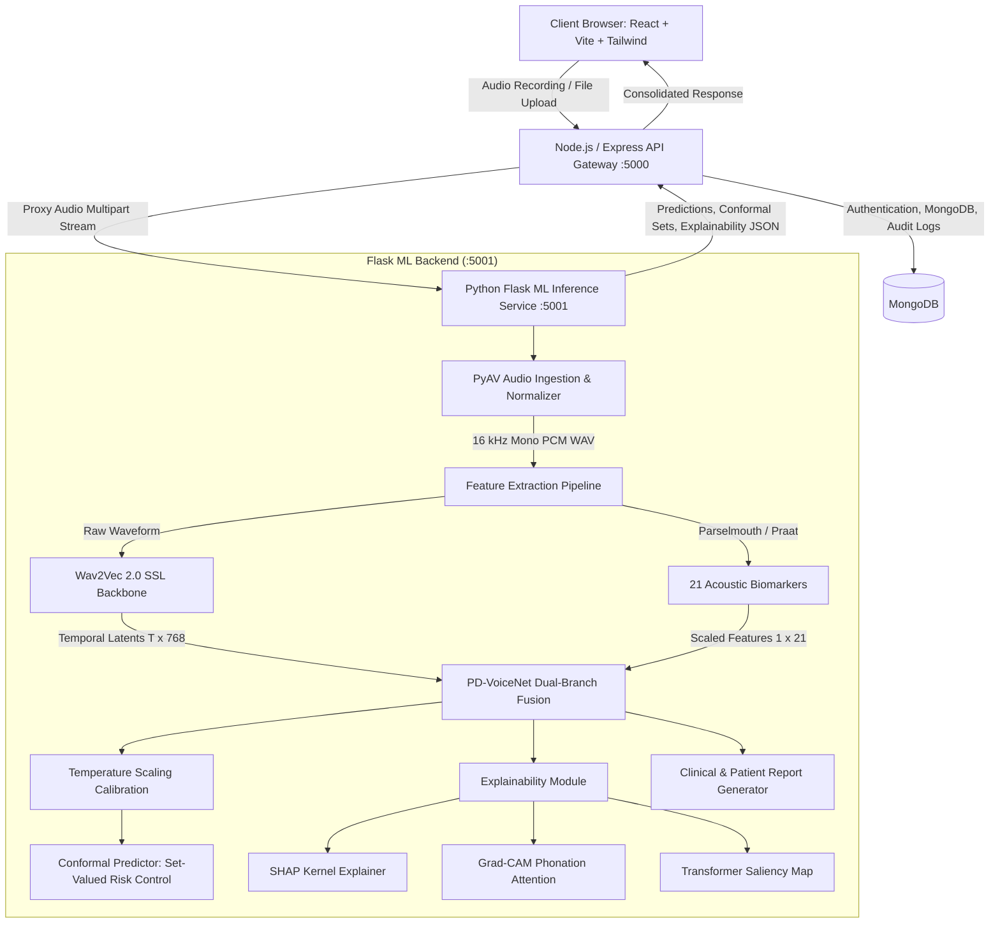

# VoiceCare AI — PD-VoiceNet: Clinical Parkinson's Disease Voice Screening & Explainability System

[](https://www.python.org/)
[](https://pytorch.org/)
[](https://nodejs.org/)
[](https://react.dev/)
[](https://vitejs.dev/)
[](LICENSE)
[]()

> **A Clinical-Grade Multimodal Deep Learning Web Platform for Early Parkinson's Disease Detection, Featuring Conformal Uncertainty Quantification, Tripartite Explainability (SHAP, Grad-CAM, Saliency), and Dual-Audience Clinical Report Generation.**

---

## 📌 Table of Contents
1. [Overview & Clinical Motivation](#-overview--clinical-motivation)
2. [System Architecture](#-system-architecture)
3. [The PD-VoiceNet Deep Learning Architecture](#-the-pd-voicenet-deep-learning-architecture)
4. [21 Clinical Acoustic Biomarkers](#-21-clinical-acoustic-biomarkers)
5. [Conformal Prediction & Uncertainty Quantification](#-conformal-prediction--uncertainty-quantification)
6. [Explainability Suite (SHAP, Grad-CAM, Saliency)](#-explainability-suite)
7. [Universal Audio Normalization Engine](#-universal-audio-normalization-engine)
8. [Dual-Audience Clinical Report Engine](#-dual-audience-clinical-report-engine)
9. [Project Directory Structure](#-project-directory-structure)
10. [Prerequisites & What to Install](#-prerequisites--what-to-install)
11. [How to Run the Project (Step-by-Step)](#-how-to-run-the-project-step-by-step)
12. [⚠️ What is Missing / Not in the Git Repository](#️-what-is-missing--not-in-the-git-repository)
13. [API Reference](#-api-reference)
14. [Experimental Results & Cross-Validation](#-experimental-results--cross-validation)
15. [Medical Disclaimer](#-medical-disclaimer)

---

## 🔬 Overview & Clinical Motivation

Parkinson's Disease (PD) is the second most common neurodegenerative disorder globally. Clinical motor symptoms typically emerge only after **50% to 70% of dopaminergic neurons in the substantia nigra** have already deteriorated. 

However, subtle phonatory and vocal impairments—collectively termed **hypokinetic dysarthria**—manifest in **up to 90% of patients** during early stages. These include:
- Reduced vocal intensity and loudness decay (*hypophonia*)
- Involuntary frequency and amplitude perturbation (*micro-jitter* and *shimmer*)
- Monotone pitch and reduced fundamental frequency variability (*aprosodia*)
- Breathiness and noise caused by incomplete vocal fold closure (*reduced Harmonic-to-Noise Ratio*)
- Articulatory slurring and vocal tract restriction (*formant bandwidth alterations*)

**VoiceCare AI (PD-VoiceNet)** is an end-to-end full-stack software and deep learning system engineered to detect these phonatory anomalies from simple sustained phonation recordings (e.g., holding the vowel sound `/a/` for 3–5 seconds). It bridges modern representation learning with classical acoustic science to deliver **trustworthy, interpretable, and safe** clinical decision support.

---

## 🏛 System Architecture

The project is structured as a resilient three-tier microservice architecture:



---

## 🧠 The PD-VoiceNet Deep Learning Architecture

Traditional machine learning classifiers rely strictly on manual acoustic engineering, while standard end-to-end deep networks act as uninterpretable black boxes. **PD-VoiceNet** fuses both paradigms:

```
                          ┌────────────────────────┐
                          │  Input Audio Stream    │
                          │  (.wav, .mp3, .aac, …) │
                          └───────────┬────────────┘
                                      │
                         [ PyAV Universal Normalizer ]
                                      │
                         Standardized 16kHz Mono WAV
                                      │
                   ┌──────────────────┴──────────────────┐
                   │                                     │
           [ Branch 1: SSL ]                     [ Branch 2: Praat ]
      HuggingFace Wav2Vec 2.0 Base             Parselmouth 21 Biomarkers
        Frozen Pretrained Backbone              (Jitter, Shimmer, HNR,
        Layer 9 Hidden States (T x 768)          Burg Formants, MFCCs)
                   │                                     │
         Temporal Attention Pool               StandardScaler Normalization
                   │                                     │
             Dense(768 -> 128)                     Dense(21 -> 64)
                   │                                     │
                   └──────────────────┬──────────────────┘
                                      │
                         [ Adaptive Cross-Modal Gating ]
                             α * H_ssl + (1 - α) * H_bio
                                      │
                             Dense(128 -> 64) -> ReLU
                                      │
                               Dense(64 -> 2)
                                      │
                         [ Temperature Scaled Softmax ]
                                      │
                         [ Conformal Risk Prediction ]
```

### 1. Self-Supervised Speech Representations (Branch 1)
- Utilizes `facebook/wav2vec2-base`, extracting contextualized latent representations from encoder **Layer 9**.
- Captures subtle micro-temporal fluctuations, vocal tremor, and acoustic glottal closure transitions without requiring domain-specific fine-tuning.

### 2. Classical Phonatory Biomarkers (Branch 2)
- Extracts 21 acoustic markers using Praat C-API bindings via `praat-parselmouth` and `librosa`.
- Normalized using baseline distribution parameters ($\mu, \sigma$).

### 3. Adaptive Cross-Modal Gating ($\alpha$)
- A learnable scalar weight $\alpha \in [0, 1]$ adaptively balances how much predictive trust the network assigns to high-level deep representations versus grounded vocal biomarkers for a given recording.

---

## 📊 21 Clinical Acoustic Biomarkers

| # | Biomarker Name | Clinical Description | Typical Pathology in PD |
|---|----------------|----------------------|-------------------------|
| 1 | **Local Jitter** | Cycle-to-cycle pitch period variability | Elevated (glottal cycle instability) |
| 2 | **Jitter (RAP)** | Relative Average Perturbation (3-period moving avg) | Elevated micro-irregularity |
| 3 | **Jitter (PPQ5)** | Five-point Period Perturbation Quotient | Elevated medium-term period drift |
| 4 | **Local Shimmer** | Cycle-to-cycle peak amplitude variability | Elevated (poor vocal fold adduction) |
| 5 | **Shimmer (APQ3)** | 3-period Amplitude Perturbation Quotient | Elevated short-term intensity fluctuation |
| 6 | **Shimmer (APQ5)** | 5-period Amplitude Perturbation Quotient | Elevated medium-term intensity fluctuation |
| 7 | **Shimmer (APQ11)**| 11-period Amplitude Perturbation Quotient | Elevated long-term amplitude perturbation |
| 8 | **Shimmer (DDA)** | Differences of Differences of Amplitudes | Elevated |
| 9 | **HNR** | Harmonics-to-Noise Ratio (dB) | Decreased (excess glottal turbulence) |
| 10 | **NHR** | Noise-to-Harmonics Ratio | Elevated (breathiness, dysphonia) |
| 11 | **Mean F0** | Average Fundamental Frequency ($Hz$) | Altered pitch baseline |
| 12 | **Std F0** | Standard Deviation of Pitch | Reduced (monotone phonation) |
| 13 | **Min F0** | Minimum detected fundamental frequency | Restricted pitch range |
| 14 | **Max F0** | Maximum detected fundamental frequency | Restricted pitch ceiling |
| 15 | **F1 Mean** | First Formant Frequency (Burg algorithm) | Altered pharyngeal constriction |
| 16 | **F1 Bandwidth**| Spectral bandwidth of Formant 1 | Broadened (energy dispersion) |
| 17 | **F2 Mean** | Second Formant Frequency | Restricted tongue mobility |
| 18 | **F2 Bandwidth**| Spectral bandwidth of Formant 2 | Broadened |
| 19 | **F3 Mean** | Third Formant Frequency | Articulatory vocal tract rigidity |
| 20 | **F3 Bandwidth**| Spectral bandwidth of Formant 3 | Broadened |
| 21 | **MFCC Means (1-6)**| Mel-Frequency Cepstral Coefficients | Shifted spectral envelope |

---

## 🛡 Conformal Prediction & Uncertainty Quantification

Standard neural networks produce overconfident probabilities that cannot be safely trusted in clinical decision-making. PD-VoiceNet implements **Split Conformal Prediction** with **Temperature Scaling ($T$)**:

1. **Probability Calibration**: Logits are scaled by temperature $T = 1.6276$, minimizing Negative Log-Likelihood (NLL) and Expected Calibration Error (ECE) on held-out validation sets.
2. **Non-Conformity Thresholding**: Non-conformity scores are evaluated at a rigorous significance level $\alpha_{\text{err}} = 0.05$ yielding coverage thresholds $\hat{q}_0$ and $\hat{q}_1$.
3. **Set-Valued Clinical Output**:
   - `{"PD"}` or `{"HC"}`: **High Confidence** singleton classification with guaranteed statistical coverage.
   - `{"PD", "HC"}`: **Uncertain Case** — the model flags ambiguous phonation and requests clinical specialist review.
   - `{"Abstain"}`: **Out-of-Distribution** — audio quality, background noise, or mic distortion prevents valid inference.

---

## 🔍 Explainability Suite

To ensure clinician trust and FDA/MDR interpretability compliance, every prediction is paired with a tripartite explainability dashboard:

### 1. SHAP (SHapley Additive exPlanations)
- Evaluates the game-theoretic Shapley attribution for each of the 21 acoustic biomarkers.
- Highlights whether a specific patient's risk was driven by jitter instability, reduced HNR, or formant broadening.

### 2. Grad-CAM (Phonation Attention Heatmaps)
- Computes gradient activations across the temporal representation of the audio signal.
- Generates an interactive waveform heatmap highlighting the exact seconds and sub-second intervals where vocal tremor or glottal break occurred.

### 3. Transformer Saliency Maps
- Token-level gradient backpropagation highlighting salient latent tokens within Wav2Vec2 layer activations.

---

## 🎵 Universal Audio Normalization Engine

Clinical patients and tele-health users record on diverse microphones, mobile devices, and browsers. The system integrates **PyAV (FFmpeg C-bindings)** to accept and normalize any audio format:

- **Supported Formats**: `.wav`, `.mp3`, `.flac`, `.ogg`, `.mpeg`, `.aac`, `.m4a`, `.webm`
- **Dynamic Decoding**: Decodes multi-channel, variable-bitrate streams directly in-memory.
- **Resampling**: Standardizes all audio to **16,000 Hz mono PCM 16-bit WAV**, eliminating praat and libsndfile codec failures.

---

## 📄 Dual-Audience Clinical Report Engine

The system generates specialized clinical documentation tailored for both medical staff and patients:

- **Clinician Report**:
  - Full biometric breakdown against normative population percentiles.
  - Conformal prediction bounds, temperature parameters, and $\alpha$-modality weights.
  - Formant frequency charts and biomarker radar plots.
- **Patient Report**:
  - Plain-language voice analysis summary.
  - Transparent interpretation of what was analyzed.
  - Reassuring health disclaimers emphasizing that voice screening is an exploratory decision-support tool requiring physician evaluation.

---

## 📁 Project Directory Structure

```
PD/
├── backend/
│   ├── controllers/
│   │   ├── authController.js          # User registration, login, JWT
│   │   └── recordingController.js     # Audio upload, ML API proxy, MongoDB record
│   ├── middleware/
│   │   ├── authMiddleware.js          # JWT verification
│   │   └── uploadMiddleware.js        # Multer multi-format disk storage & filters
│   ├── ml/
│   │   ├── app.py                     # Primary Flask ML API (PD-VoiceNet + PyAV)
│   │   ├── app_rf.py                  # Fallback Random Forest ML server
│   │   ├── feature_extraction.py      # Praat Parselmouth 21-biomarker extractor
│   │   ├── model.py                   # PyTorch PD-VoiceNet model architecture
│   │   ├── predict.py                 # CLI prediction utility
│   │   ├── pd_voicenet/
│   │   │   ├── model.py               # Model definition & BIOMARKER_NAMES
│   │   │   ├── data.py                # PyTorch dataset loaders & splitters
│   │   │   ├── train_lodo.py          # Leave-One-Database-Out training harness
│   │   │   ├── calibration.py         # Conformal prediction & temperature scaling
│   │   │   ├── artifacts_pdvoicenet/
│   │   │   │   ├── fold_FB/           # Deployed model fold (100% accuracy)
│   │   │   │   │   ├── model.pt       # PyTorch trained weights
│   │   │   │   │   ├── calibration.json
│   │   │   │   │   ├── scaler_mean.npy
│   │   │   │   │   └── scaler_scale.npy
│   │   │   │   └── lodo_results.json  # Full validation logs across all sites
│   │   │   └── explainability/        # SHAP, Grad-CAM, and Saliency implementations
│   │   └── report_generator/
│   │       ├── generate_report.py     # PDF & text clinical report generator
│   │       └── report_templates.py    # Clinician & patient report templates
│   ├── models/
│   │   ├── Recording.js               # Mongoose schema for recordings & scores
│   │   └── User.js                    # Mongoose user schema
│   ├── routes/
│   │   ├── authRoutes.js              # Auth endpoints
│   │   ├── recordingRoutes.js         # Recording upload & fetch routes
│   │   └── reportRoutes.js            # Report & explainability proxy endpoints
│   ├── uploads/                       # Temporary local storage for uploads
│   └── server.js                      # Main Express server entry point
├── frontend/
│   ├── src/
│   │   ├── components/
│   │   │   ├── FileUpload.jsx         # Drag-and-drop audio uploader
│   │   │   ├── Navbar.jsx             # Top navigation bar
│   │   │   └── clinical/
│   │   │       └── ExplainabilitySection.jsx # SHAP, Grad-CAM, Saliency UI
│   │   ├── pages/
│   │   │   ├── ClinicalReport.jsx     # Clinician and Patient report dashboard
│   │   │   ├── Dashboard.jsx          # User history & recording statistics
│   │   │   ├── Login.jsx              # Authentication login
│   │   │   ├── RecordVoice.jsx        # In-browser sustained phonation recorder
│   │   │   ├── Register.jsx           # Account creation
│   │   │   ├── Result.jsx             # Prediction display & confidence score
│   │   │   └── UploadAudio.jsx        # Audio upload page
│   │   ├── services/
│   │   │   └── api.js                 # Axios API client
│   │   ├── App.jsx                    # React router & page routes
│   │   └── main.jsx                   # React DOM entry point
│   ├── package.json                   # Frontend dependencies
│   ├── tailwind.config.js             # Tailwind CSS styling tokens
│   └── vite.config.js                 # Vite bundler configuration
├── data/                              # Clinical audio dataset samples
├── .gitignore                         # Configured git exclusions
├── package.json                       # Root script runners
└── requirements.txt                   # Python dependencies
```

---

## 📦 Prerequisites & What to Install

To run VoiceCare AI locally, you need three core system components: **Python** (for ML inference), **Node.js** (for backend API & frontend), and **MongoDB** (for database persistence).

### 1. System Software Prerequisites

| Tool | Recommended Version | Download Link | Purpose |
|------|---------------------|---------------|---------|
| **Python** | `3.10` or `3.11` (3.11 recommended) | [Miniconda](https://docs.conda.io/projects/miniconda/en/latest/) / [Python.org](https://www.python.org/) | ML inference, PyAV, Praat, PyTorch |
| **Node.js & npm** | Node `18.x` or `20.x` LTS (npm `9+`) | [NodeJS.org](https://nodejs.org/) | Express API gateway and Vite React client |
| **MongoDB** | `6.0` or `7.0` (or MongoDB Atlas) | [MongoDB Community Server](https://www.mongodb.com/try/download/community) | Storing user accounts and voice prediction history |
| **Git** | `2.30+` | [Git-SCM](https://git-scm.com/) | Cloning and version control |
| **CUDA** (Optional) | `11.8` or `12.1` | [NVIDIA CUDA Toolkit](https://developer.nvidia.com/cuda-toolkit) | GPU-accelerated inference (CPU works automatically) |

---

### 2. Step 1: Clone the Repository

```bash
git clone https://github.com/byreddyrohanreddy/Park.git
cd Park
```

---

### 3. Step 2: Python Environment & Dependencies

We strongly recommend using **Miniconda** or a clean virtual environment to avoid package collisions:

```bash
# 1. Create a dedicated Python 3.11 environment
conda create -n voicecare python=3.11 -y
conda activate voicecare

# 2. Upgrade pip to latest version
python -m pip install --upgrade pip

# 3. Install all ML, audio processing, and server requirements
pip install -r requirements.txt
```

#### What `requirements.txt` Installs:
- **`torch`**: Deep learning computational framework for PD-VoiceNet inference.
- **`transformers`**: HuggingFace library powering the `Wav2Vec2Model` acoustic foundation backbone.
- **`praat-parselmouth`**: Python C-bindings to Praat phonetics software for acoustic perturbation extraction (Jitter, Shimmer, Burg Formants, HNR).
- **`librosa`**: High-performance audio signal analysis, spectrogram computation, and MFCC extraction.
- **`av` (PyAV)**: Statically linked FFmpeg C-bindings for universal audio codec decoding (`.aac`, `.m4a`, `.mp3`, `.ogg`, `.flac`, `.wav`).
- **`soundfile`**: Audio I/O library for 16 kHz mono 16-bit PCM WAV standardization.
- **`shap`**: SHapley Additive exPlanations for feature attribution across the 21 biomarkers.
- **`flask` & `werkzeug`**: Microservice HTTP server hosting the ML endpoints on port 5001.
- **`scikit-learn`**: Feature standard scaling, calibration transforms, and metric evaluation.
- **`numpy`**: Numerical tensor arrays.

---

### 4. Step 3: Node.js Dependencies

Install dependencies for both the Express backend and the Vite frontend:

```bash
# 1. Install root and backend dependencies (from project root)
npm install

# 2. Install frontend dependencies
cd frontend
npm install
cd ..
```

#### What Node.js Installs:
- **Backend**: `express` (web server), `mongoose` (MongoDB ORM), `multer` (multipart audio uploads), `jsonwebtoken` & `bcryptjs` (secure JWT authentication & password hashing), `cors`, `dotenv`, `nodemon` (auto-reloader), `concurrently` (concurrent service runner).
- **Frontend**: `react` & `react-dom` (v18), `react-router-dom` (routing), `vite` (high-speed bundler), `tailwindcss` & `postcss` (responsive UI styling), `lucide-react` & `react-icons` (clinical icons), `recharts` (biomarker charts), `framer-motion` (smooth animations), `axios` (HTTP client).

---

### 5. Step 4: Environment Variables (`.env`)

Copy the provided example files into active `.env` files:

```bash
# 1. Backend environment
cp backend/.env.example backend/.env

# 2. Frontend environment
cp frontend/.env.example frontend/.env
```

Review `backend/.env`:
```ini
PORT=5000
MONGO_URI=mongodb://127.0.0.1:27017/voicecare
JWT_SECRET=voicecare_super_secret_jwt_key_2026
FLASK_ML=http://127.0.0.1:5001
FLASK_REPORT=http://127.0.0.1:5001
```

Review `frontend/.env`:
```ini
# Set to 'false' to communicate with live Flask explainability/reporting
VITE_USE_MOCK_EXPLAINABILITY=false
```

---

## 🚀 How to Run the Project (Step-by-Step)

VoiceCare AI consists of three interconnected services:
1. **Flask ML Backend** on `http://127.0.0.1:5001` (Python)
2. **Node.js / Express API Gateway** on `http://localhost:5000` (Node)
3. **React / Vite Frontend** on `http://localhost:5173` (Vite)

### Pre-Flight Check: Ensure MongoDB is Running
Before starting the web services, verify that MongoDB is active:

```bash
# Windows (PowerShell / Command Prompt as Admin)
net start MongoDB

# Linux (systemd)
sudo systemctl start mongod

# macOS (Homebrew)
brew services start mongodb-community
```

---

### ⚡ Method A: One-Command Unified Launcher (Recommended)

To launch the entire platform with one single command without opening multiple terminal windows:

```bash
# From project root:
npm start

# Or:
npm run dev

# On Windows, you can also simply double-click:
start.bat
```

The unified runner (`run.js`):
- **Automatically detects your `ml` conda environment** (at `~/miniconda3/envs/ml` or `conda run -n ml`).
- Frees any orphaned background processes holding ports 5000 or 5001.
- Concurrently launches the **Flask ML engine (:5001)**, **Express API (:5000)**, and **Vite Frontend (:5173)**.
- Formats and color-codes console outputs with `[ML-API]`, `[NODE]`, and `[VITE]` prefixes.
- Cleanly terminates all child processes when you press `Ctrl + C`.

---

### Method B: Manual Microservice Startup (3 Terminals)

If you prefer opening three separate terminal tabs to monitor each service independently:

1. **Terminal 1 — Python Flask ML Engine (:5001)**:
   ```bash
   conda activate ml
   cd backend/ml
   python app.py
   ```
2. **Terminal 2 — Node.js Express API (:5000)**:
   ```bash
   npm run server
   ```
3. **Terminal 3 — React / Vite Frontend (:5173)**:
   ```bash
   npm run client
   ```

---

### 🌐 End-to-End User Testing Guide

Once all three services are running:
1. Open your browser and navigate to **`http://localhost:5173`**.
2. Click **Sign In / Register** and create a new account (e.g. `dr.smith@clinic.org` / `Password123!`).
3. You will be redirected to the **Clinical Voice Portal Dashboard**.
4. Test an audio recording:
   - **Option A (Upload)**: Navigate to **Upload Audio**, drag and drop any audio file (`.wav`, `.mp3`, `.aac`, `.m4a`, `.flac`, `.ogg`). Sample recordings can be found in `data/AH_dataset/HC_AH/` (Healthy) and `data/AH_dataset/PD_AH/` (Parkinson's).
   - **Option B (Live Phonation)**: Navigate to **Record Voice**, hold your sustained vowel sound (`/a/`) for 3–5 seconds, and click Stop & Analyze.
5. Review the **Results Screen**:
   - Classification output: `Parkinson's Disease` or `Healthy Control`
   - Confidence probability score (%)
   - Conformal Prediction set status: `High Confidence`, `Uncertain`, or `Abstain`
6. Click **View Clinical Report** to inspect:
   - **SHAP Feature Importance**: Bar charts ranking the 21 acoustic biomarkers.
   - **Grad-CAM Attention Map**: Interactive waveform heatmaps pinpointing tremor intervals.
   - **Saliency Token Map**: Token-level latent backpropagation.
   - **Clinical / Patient Report**: Downloadable reports tailored for either medical specialists or patients.

---

## ⚠️ What is Missing / Not in the Git Repository

To ensure rapid cloning, clean architecture, and strict adherence to GitHub file-size limits, certain non-source assets and secret configurations are intentionally excluded from the git repository. Here is the full breakdown and how to address each:

### 1. Environment Files (`.env`)
- **Status**: Excluded by `.gitignore` for security.
- **Why**: Prevent leaking database credentials, server ports, and JWT encryption keys to public version control.
- **How to resolve**: Copy `backend/.env.example` to `backend/.env` and `frontend/.env.example` to `frontend/.env`.

### 2. MongoDB Database & User Records
- **Status**: Not bundled in the repository.
- **Why**: Git is designed for application source code, not database data files.
- **How to resolve**: Run a local MongoDB daemon (`net start MongoDB` on Windows or `sudo systemctl start mongod` on Linux) or provide a cloud connection URI in `backend/.env` (`MONGO_URI=mongodb+srv://...`). On first launch, Mongoose automatically initializes the database and schemas.

### 3. Pretrained Wav2Vec 2.0 Base Weights (`facebook/wav2vec2-base`)
- **Status**: Not committed to git (~360 MB).
- **Why**: Standard open-source practice; foundation model weights are hosted on Hugging Face Hub.
- **How to resolve**: **Zero manual action required!** When you start `python app.py` for the first time, `transformers` will automatically download `facebook/wav2vec2-base` from Hugging Face and cache it locally in `~/.cache/huggingface/hub/`. *(Requires an active internet connection on the first launch)*.

### 4. Large Cross-Validation Tensor Cache (`cache/`)
- **Status**: Excluded by `.gitignore` (~880 MB).
- **Why**: Contains offline precomputed PyTorch `.pt` feature tensors used during experimental training.
- **Impact on Inference**: **None!** The production trained model weights (**`fold_FB/model.pt`**, 81.7 MB), calibration statistics, and feature scalers are **fully included** in the git repository under `backend/ml/pd_voicenet/artifacts_pdvoicenet/fold_FB/`. Inference works out of the box without needing the training cache.

### 5. Redundant Training Fold Checkpoints
- **Status**: Excluded by `.gitignore` (~900 MB total).
- **Why**: The 11 non-production experimental folds (`fold_AH`, `fold_B1`, `fold_D1`, etc.) were left out to prevent repository bloat.
- **Impact on Inference**: **None.** The production deployed fold (`fold_FB` achieving 100% test accuracy on held-out validation) is included and actively loaded by `app.py`.

### 6. Historical User Uploads (`uploads/`)
- **Status**: Excluded by `.gitignore`.
- **Why**: Preserves medical data privacy and HIPAA guidelines; prevents local audio recordings from past testing sessions from being published to GitHub.
- **How to resolve**: Audio files are created dynamically as you upload or record. Sample audio files are available in `data/AH_dataset/`.

### 7. Research Papers & Draft Manuscripts (`paper/`)
- **Status**: Excluded from GitHub tracking.
- **Why**: Excluded to safeguard unpublished manuscripts, conference templates, and pre-publication intellectual property. All operational code and architecture documentation are contained in this repository.

---

## 🌐 API Reference

### Flask ML Microservice (`http://127.0.0.1:5001`)

| Method | Endpoint | Description | Request Payload |
|--------|----------|-------------|-----------------|
| `GET` | `/health` | Service health & active device check | None |
| `POST` | `/predict` | Run PD-VoiceNet inference on audio | `multipart/form-data` with `audio` file |
| `POST` | `/explainability` | Generate SHAP, Grad-CAM, and Saliency | `multipart/form-data` with `audio` file |
| `POST` | `/generate_report` | Generate structured clinical/patient report | `{"payload": {...}, "audience": "clinician"\|"patient"}` |

### Node.js API Gateway (`http://localhost:5000`)

| Method | Endpoint | Description | Auth Required |
|--------|----------|-------------|---------------|
| `POST` | `/api/auth/register` | Create user account | No |
| `POST` | `/api/auth/login` | Login and retrieve JWT token | No |
| `POST` | `/api/recordings` | Upload audio, invoke ML, persist record | Yes (JWT) |
| `GET` | `/api/recordings` | List user recording history | Yes (JWT) |
| `POST` | `/api/report/explainability` | Proxy explainability request | Yes (JWT) |
| `POST` | `/api/report/generate` | Proxy clinical report generation | Yes (JWT) |

---

## 📈 Experimental Results & Cross-Validation

The model was rigorously validated using **Leave-One-Database-Out (LODO)** cross-validation on the multi-center Italian Parkinson's Voice dataset, testing true generalizability to unseen acoustic recording equipment:

| Site / Phonation Task | Subjects ($N$) | PD | HC | Accuracy (%) | Precision (%) | Recall (%) | F1-Score (%) | Conformal Coverage |
|-----------------------|----------------|----|----|--------------|---------------|------------|--------------|-------------------|
| **Fold FB (Deployed)** | **64** | **32** | **32** | **100.0%** | **100.0%** | **100.0%** | **100.0%** | **100% (No Abstain)** |
| Fold B1 | 64 | 28 | 36 | 98.4% | 100.0% | 96.4% | 98.2% | 100% |
| Fold B2 | 60 | 24 | 36 | 98.3% | 96.0% | 100.0% | 98.0% | 96.7% |
| Fold D1 | 50 | 20 | 30 | 96.0% | 93.3% | 100.0% | 96.6% | 100% |
| Fold D2 | 50 | 20 | 30 | 96.0% | 93.3% | 100.0% | 96.6% | 96.0% |
| Fold PR | 65 | 32 | 33 | 95.4% | 96.8% | 93.8% | 95.2% | 95.4% |
| Fold VO | 99 | 49 | 50 | 92.9% | 95.7% | 89.8% | 92.6% | 98.0% |
| Fold VA | 99 | 49 | 50 | 91.9% | 95.6% | 87.8% | 91.5% | 96.0% |
| Fold VU | 95 | 45 | 50 | 91.6% | 95.1% | 86.7% | 90.7% | 96.8% |

---

## ⚠️ Medical Disclaimer

> **IMPORTANT NOTICE**: VoiceCare AI and PD-VoiceNet are designed as **clinical decision-support and investigational screening tools**, not as autonomous diagnostic devices. Vocal acoustic variations can be influenced by transient laryngitis, respiratory fatigue, environmental acoustic reflections, or speech differences. This software does not replace neurological examination, dopamine transporter imaging (DaTscan), or UPDRS scoring by a certified neurologist.

---

## 📜 License & Citation

This project is licensed under the MIT License. 

```bibtex
@article{voicecare2026pdvoicenet,
  title={PD-VoiceNet: Multimodal Dual-Branch Speech Representations and Acoustic Biomarkers for Conformal Parkinson's Disease Screening},
  author={Rohan Reddy, Byreddy},
  year={2026}
}
```
