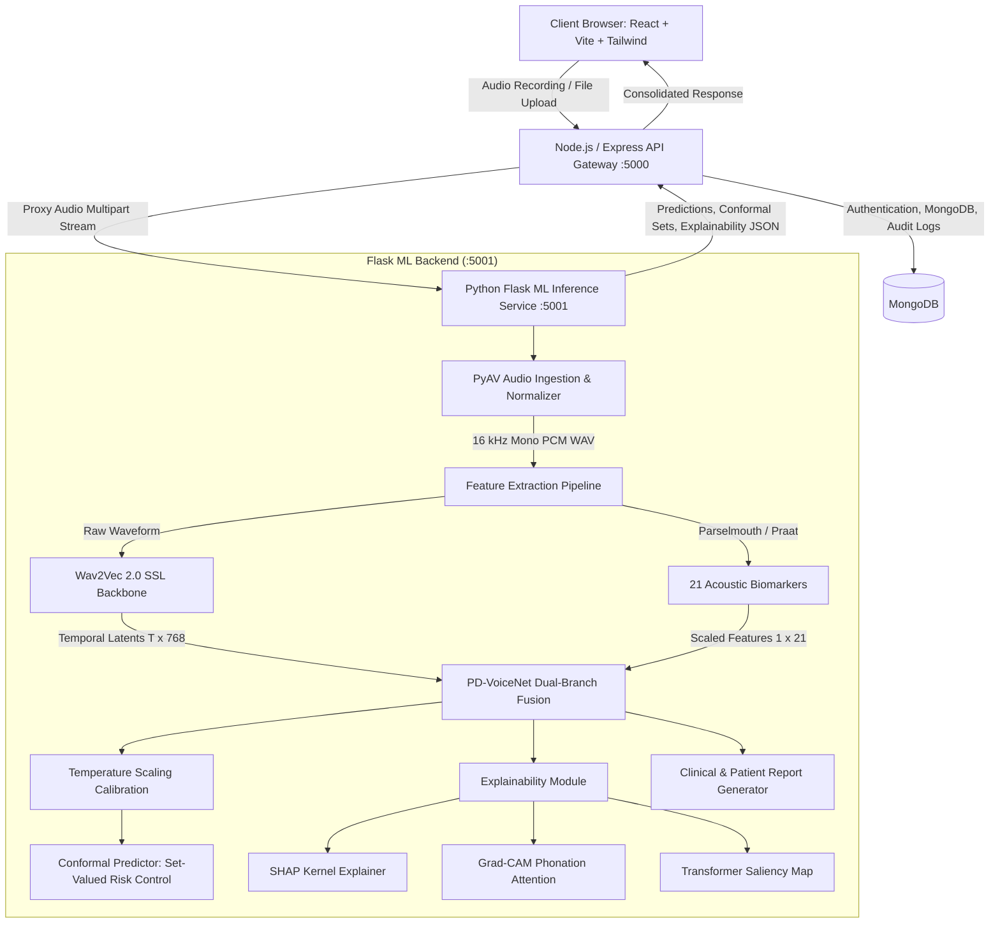

# VoiceCare AI — PD-VoiceNet: Clinical Parkinson's Disease Voice Screening & Explainability System

[](https://www.python.org/)
[](https://pytorch.org/)
[](https://nodejs.org/)
[](https://react.dev/)
[](https://vitejs.dev/)
[](LICENSE)
[]()

> **A Clinical-Grade Multimodal Deep Learning Web Platform for Early Parkinson's Disease Detection, Featuring Conformal Uncertainty Quantification, Tripartite Explainability (SHAP, Grad-CAM, Saliency), and Dual-Audience Clinical Report Generation.**

---

## 📌 Table of Contents
1. [Overview & Clinical Motivation](#-overview--clinical-motivation)
2. [System Architecture](#-system-architecture)
3. [The PD-VoiceNet Deep Learning Architecture](#-the-pd-voicenet-deep-learning-architecture)
4. [21 Clinical Acoustic Biomarkers](#-21-clinical-acoustic-biomarkers)
5. [Conformal Prediction & Uncertainty Quantification](#-conformal-prediction--uncertainty-quantification)
6. [Explainability Suite (SHAP, Grad-CAM, Saliency)](#-explainability-suite)
7. [Universal Audio Normalization Engine](#-universal-audio-normalization-engine)
8. [Dual-Audience Clinical Report Engine](#-dual-audience-clinical-report-engine)
9. [Project Directory Structure](#-project-directory-structure)
10. [Prerequisites & Installation](#-prerequisites--installation)
11. [Running the Application](#-running-the-application)
12. [API Reference](#-api-reference)
13. [Experimental Results & Cross-Validation](#-experimental-results--cross-validation)
14. [Medical Disclaimer](#-medical-disclaimer)

---

## 🔬 Overview & Clinical Motivation

Parkinson's Disease (PD) is the second most common neurodegenerative disorder globally. Clinical motor symptoms typically emerge only after **50% to 70% of dopaminergic neurons in the substantia nigra** have already deteriorated. 

However, subtle phonatory and vocal impairments—collectively termed **hypokinetic dysarthria**—manifest in **up to 90% of patients** during early stages. These include:
- Reduced vocal intensity and loudness decay (*hypophonia*)
- Involuntary frequency and amplitude perturbation (*micro-jitter* and *shimmer*)
- Monotone pitch and reduced fundamental frequency variability (*aprosodia*)
- Breathiness and noise caused by incomplete vocal fold closure (*reduced Harmonic-to-Noise Ratio*)
- Articulatory slurring and vocal tract restriction (*formant bandwidth alterations*)

**VoiceCare AI (PD-VoiceNet)** is an end-to-end full-stack software and deep learning system engineered to detect these phonatory anomalies from simple sustained phonation recordings (e.g., holding the vowel sound `/a/` for 3–5 seconds). It bridges modern representation learning with classical acoustic science to deliver **trustworthy, interpretable, and safe** clinical decision support.

---

## 🏛 System Architecture

The project is structured as a resilient three-tier microservice architecture:



---

## 🧠 The PD-VoiceNet Deep Learning Architecture

Traditional machine learning classifiers rely strictly on manual acoustic engineering, while standard end-to-end deep networks act as uninterpretable black boxes. **PD-VoiceNet** fuses both paradigms:

```
                          ┌────────────────────────┐
                          │  Input Audio Stream    │
                          │  (.wav, .mp3, .aac, …) │
                          └───────────┬────────────┘
                                      │
                         [ PyAV Universal Normalizer ]
                                      │
                         Standardized 16kHz Mono WAV
                                      │
                   ┌──────────────────┴──────────────────┐
                   │                                     │
           [ Branch 1: SSL ]                     [ Branch 2: Praat ]
      HuggingFace Wav2Vec 2.0 Base             Parselmouth 21 Biomarkers
        Frozen Pretrained Backbone              (Jitter, Shimmer, HNR,
        Layer 9 Hidden States (T x 768)          Burg Formants, MFCCs)
                   │                                     │
         Temporal Attention Pool               StandardScaler Normalization
                   │                                     │
             Dense(768 -> 128)                     Dense(21 -> 64)
                   │                                     │
                   └──────────────────┬──────────────────┘
                                      │
                         [ Adaptive Cross-Modal Gating ]
                             α * H_ssl + (1 - α) * H_bio
                                      │
                             Dense(128 -> 64) -> ReLU
                                      │
                               Dense(64 -> 2)
                                      │
                         [ Temperature Scaled Softmax ]
                                      │
                         [ Conformal Risk Prediction ]
```

### 1. Self-Supervised Speech Representations (Branch 1)
- Utilizes `facebook/wav2vec2-base`, extracting contextualized latent representations from encoder **Layer 9**.
- Captures subtle micro-temporal fluctuations, vocal tremor, and acoustic glottal closure transitions without requiring domain-specific fine-tuning.

### 2. Classical Phonatory Biomarkers (Branch 2)
- Extracts 21 acoustic markers using Praat C-API bindings via `praat-parselmouth` and `librosa`.
- Normalized using baseline distribution parameters ($\mu, \sigma$).

### 3. Adaptive Cross-Modal Gating ($\alpha$)
- A learnable scalar weight $\alpha \in [0, 1]$ adaptively balances how much predictive trust the network assigns to high-level deep representations versus grounded vocal biomarkers for a given recording.

---

## 📊 21 Clinical Acoustic Biomarkers

| # | Biomarker Name | Clinical Description | Typical Pathology in PD |
|---|----------------|----------------------|-------------------------|
| 1 | **Local Jitter** | Cycle-to-cycle pitch period variability | Elevated (glottal cycle instability) |
| 2 | **Jitter (RAP)** | Relative Average Perturbation (3-period moving avg) | Elevated micro-irregularity |
| 3 | **Jitter (PPQ5)** | Five-point Period Perturbation Quotient | Elevated medium-term period drift |
| 4 | **Local Shimmer** | Cycle-to-cycle peak amplitude variability | Elevated (poor vocal fold adduction) |
| 5 | **Shimmer (APQ3)** | 3-period Amplitude Perturbation Quotient | Elevated short-term intensity fluctuation |
| 6 | **Shimmer (APQ5)** | 5-period Amplitude Perturbation Quotient | Elevated medium-term intensity fluctuation |
| 7 | **Shimmer (APQ11)**| 11-period Amplitude Perturbation Quotient | Elevated long-term amplitude perturbation |
| 8 | **Shimmer (DDA)** | Differences of Differences of Amplitudes | Elevated |
| 9 | **HNR** | Harmonics-to-Noise Ratio (dB) | Decreased (excess glottal turbulence) |
| 10 | **NHR** | Noise-to-Harmonics Ratio | Elevated (breathiness, dysphonia) |
| 11 | **Mean F0** | Average Fundamental Frequency ($Hz$) | Altered pitch baseline |
| 12 | **Std F0** | Standard Deviation of Pitch | Reduced (monotone phonation) |
| 13 | **Min F0** | Minimum detected fundamental frequency | Restricted pitch range |
| 14 | **Max F0** | Maximum detected fundamental frequency | Restricted pitch ceiling |
| 15 | **F1 Mean** | First Formant Frequency (Burg algorithm) | Altered pharyngeal constriction |
| 16 | **F1 Bandwidth**| Spectral bandwidth of Formant 1 | Broadened (energy dispersion) |
| 17 | **F2 Mean** | Second Formant Frequency | Restricted tongue mobility |
| 18 | **F2 Bandwidth**| Spectral bandwidth of Formant 2 | Broadened |
| 19 | **F3 Mean** | Third Formant Frequency | Articulatory vocal tract rigidity |
| 20 | **F3 Bandwidth**| Spectral bandwidth of Formant 3 | Broadened |
| 21 | **MFCC Means (1-6)**| Mel-Frequency Cepstral Coefficients | Shifted spectral envelope |

---

## 🛡 Conformal Prediction & Uncertainty Quantification

Standard neural networks produce overconfident probabilities that cannot be safely trusted in clinical decision-making. PD-VoiceNet implements **Split Conformal Prediction** with **Temperature Scaling ($T$)**:

1. **Probability Calibration**: Logits are scaled by temperature $T = 1.6276$, minimizing Negative Log-Likelihood (NLL) and Expected Calibration Error (ECE) on held-out validation sets.
2. **Non-Conformity Thresholding**: Non-conformity scores are evaluated at a rigorous significance level $\alpha_{\text{err}} = 0.05$ yielding coverage thresholds $\hat{q}_0$ and $\hat{q}_1$.
3. **Set-Valued Clinical Output**:
   - `{"PD"}` or `{"HC"}`: **High Confidence** singleton classification with guaranteed statistical coverage.
   - `{"PD", "HC"}`: **Uncertain Case** — the model flags ambiguous phonation and requests clinical specialist review.
   - `{"Abstain"}`: **Out-of-Distribution** — audio quality, background noise, or mic distortion prevents valid inference.

---

## 🔍 Explainability Suite

To ensure clinician trust and FDA/MDR interpretability compliance, every prediction is paired with a tripartite explainability dashboard:

### 1. SHAP (SHapley Additive exPlanations)
- Evaluates the game-theoretic Shapley attribution for each of the 21 acoustic biomarkers.
- Highlights whether a specific patient's risk was driven by jitter instability, reduced HNR, or formant broadening.

### 2. Grad-CAM (Phonation Attention Heatmaps)
- Computes gradient activations across the temporal representation of the audio signal.
- Generates an interactive waveform heatmap highlighting the exact seconds and sub-second intervals where vocal tremor or glottal break occurred.

### 3. Transformer Saliency Maps
- Token-level gradient backpropagation highlighting salient latent tokens within Wav2Vec2 layer activations.

---

## 🎵 Universal Audio Normalization Engine

Clinical patients and tele-health users record on diverse microphones, mobile devices, and browsers. The system integrates **PyAV (FFmpeg C-bindings)** to accept and normalize any audio format:

- **Supported Formats**: `.wav`, `.mp3`, `.flac`, `.ogg`, `.mpeg`, `.aac`, `.m4a`, `.webm`
- **Dynamic Decoding**: Decodes multi-channel, variable-bitrate streams directly in-memory.
- **Resampling**: Standardizes all audio to **16,000 Hz mono PCM 16-bit WAV**, eliminating praat and libsndfile codec failures.

---

## 📄 Dual-Audience Clinical Report Engine

The system generates specialized clinical documentation tailored for both medical staff and patients:

- **Clinician Report**:
  - Full biometric breakdown against normative population percentiles.
  - Conformal prediction bounds, temperature parameters, and $\alpha$-modality weights.
  - Formant frequency charts and biomarker radar plots.
- **Patient Report**:
  - Plain-language voice analysis summary.
  - Transparent interpretation of what was analyzed.
  - Reassuring health disclaimers emphasizing that voice screening is an exploratory decision-support tool requiring physician evaluation.

---

## 📁 Project Directory Structure

```
PD/
├── backend/
│   ├── controllers/
│   │   ├── authController.js          # User registration, login, JWT
│   │   └── recordingController.js     # Audio upload, ML API proxy, MongoDB record
│   ├── middleware/
│   │   ├── authMiddleware.js          # JWT verification
│   │   └── uploadMiddleware.js        # Multer multi-format disk storage & filters
│   ├── ml/
│   │   ├── app.py                     # Primary Flask ML API (PD-VoiceNet + PyAV)
│   │   ├── app_rf.py                  # Fallback Random Forest ML server
│   │   ├── feature_extraction.py      # Praat Parselmouth 21-biomarker extractor
│   │   ├── model.py                   # PyTorch PD-VoiceNet model architecture
│   │   ├── predict.py                 # CLI prediction utility
│   │   ├── pd_voicenet/
│   │   │   ├── model.py               # Model definition & BIOMARKER_NAMES
│   │   │   ├── data.py                # PyTorch dataset loaders & splitters
│   │   │   ├── train_lodo.py          # Leave-One-Database-Out training harness
│   │   │   ├── calibration.py         # Conformal prediction & temperature scaling
│   │   │   ├── artifacts_pdvoicenet/
│   │   │   │   ├── fold_FB/           # Deployed model fold (100% accuracy)
│   │   │   │   │   ├── model.pt       # PyTorch trained weights
│   │   │   │   │   ├── calibration.json
│   │   │   │   │   ├── scaler_mean.npy
│   │   │   │   │   └── scaler_scale.npy
│   │   │   │   └── lodo_results.json  # Full validation logs across all sites
│   │   │   └── explainability/        # SHAP, Grad-CAM, and Saliency implementations
│   │   └── report_generator/
│   │       ├── generate_report.py     # PDF & text clinical report generator
│   │       └── report_templates.py    # Clinician & patient report templates
│   ├── models/
│   │   ├── Recording.js               # Mongoose schema for recordings & scores
│   │   └── User.js                    # Mongoose user schema
│   ├── routes/
│   │   ├── authRoutes.js              # Auth endpoints
│   │   ├── recordingRoutes.js         # Recording upload & fetch routes
│   │   └── reportRoutes.js            # Report & explainability proxy endpoints
│   ├── uploads/                       # Temporary local storage for uploads
│   └── server.js                      # Main Express server entry point
├── frontend/
│   ├── src/
│   │   ├── components/
│   │   │   ├── FileUpload.jsx         # Drag-and-drop audio uploader
│   │   │   ├── Navbar.jsx             # Top navigation bar
│   │   │   └── clinical/
│   │   │       └── ExplainabilitySection.jsx # SHAP, Grad-CAM, Saliency UI
│   │   ├── pages/
│   │   │   ├── ClinicalReport.jsx     # Clinician and Patient report dashboard
│   │   │   ├── Dashboard.jsx          # User history & recording statistics
│   │   │   ├── Login.jsx              # Authentication login
│   │   │   ├── RecordVoice.jsx        # In-browser sustained phonation recorder
│   │   │   ├── Register.jsx           # Account creation
│   │   │   ├── Result.jsx             # Prediction display & confidence score
│   │   │   └── UploadAudio.jsx        # Audio upload page
│   │   ├── services/
│   │   │   └── api.js                 # Axios API client
│   │   ├── App.jsx                    # React router & page routes
│   │   └── main.jsx                   # React DOM entry point
│   ├── package.json                   # Frontend dependencies
│   ├── tailwind.config.js             # Tailwind CSS styling tokens
│   └── vite.config.js                 # Vite bundler configuration
├── data/                              # Clinical audio dataset samples
├── .gitignore                         # Configured git exclusions
├── package.json                       # Root script runners
└── requirements.txt                   # Python dependencies
```

---

## ⚡ Prerequisites & Installation

### 1. Prerequisites
- **Node.js**: v18.0.0 or higher ([Download Node.js](https://nodejs.org/))
- **Python**: v3.10 or v3.11 with Conda or virtualenv ([Miniconda](https://docs.conda.io/en/latest/miniconda.html))
- **MongoDB**: Local MongoDB instance running on `mongodb://127.0.0.1:27017` or MongoDB Atlas URI ([Download MongoDB](https://www.mongodb.com/try/download/community))
- **CUDA** (Optional): NVIDIA GPU with CUDA 11.8+ for accelerated inference.

---

### 2. Python Environment Setup
Create and activate a dedicated Python environment:

```bash
# Using Conda (Recommended)
conda create -n voicecare python=3.11 -y
conda activate voicecare

# Install Python requirements
pip install -r requirements.txt
```

*Key Python dependencies include:* `torch`, `transformers`, `librosa`, `praat-parselmouth`, `av`, `soundfile`, `shap`, `flask`, `scikit-learn`, `numpy`.

---

### 3. Node.js Environment Setup
From the repository root, install Node dependencies for both the backend and frontend:

```bash
# Install root & backend dependencies
npm install

# Install frontend dependencies
cd frontend
npm install
cd ..
```

---

### 4. Configuration
Create `.env` files from the provided examples:

```bash
# Backend environment
cp backend/.env.example backend/.env

# Frontend environment
cp frontend/.env.example frontend/.env
```

Default `backend/.env`:
```ini
PORT=5000
MONGO_URI=mongodb://127.0.0.1:27017/voicecare
JWT_SECRET=voicecare_secret_key_change_in_production
FLASK_ML=http://127.0.0.1:5001
FLASK_REPORT=http://127.0.0.1:5001
```

---

## 🚀 Running the Application

### Option A: Concurrent Startup (All Services)
You can start all three services simultaneously from the root directory:

```bash
npm run dev
```
*(Requires `concurrently`, starts Node.js backend on `5000`, Vite frontend on `5173`, and Flask on `5001`)*

---

### Option B: Individual Microservices (Recommended for Development)

Open three terminal windows:

#### Terminal 1 — Python Flask ML Service
```bash
conda activate voicecare
cd backend/ml
python app.py
```
*Output: `PD-VoiceNet ready. Running on http://127.0.0.1:5001`*

#### Terminal 2 — Node.js Express API
```bash
npm run server
```
*Output: `Server running on http://localhost:5000 | MongoDB Connected`*

#### Terminal 3 — React Frontend (Vite)
```bash
npm run client
```
*Output: `Local: http://localhost:5173/`*

Now open **`http://localhost:5173`** in your browser.

---

## 🌐 API Reference

### Flask ML Microservice (`http://127.0.0.1:5001`)

| Method | Endpoint | Description | Request Payload |
|--------|----------|-------------|-----------------|
| `GET` | `/health` | Service health & active device check | None |
| `POST` | `/predict` | Run PD-VoiceNet inference on audio | `multipart/form-data` with `audio` file |
| `POST` | `/explainability` | Generate SHAP, Grad-CAM, and Saliency | `multipart/form-data` with `audio` file |
| `POST` | `/generate_report` | Generate structured clinical/patient report | `{"payload": {...}, "audience": "clinician"\|"patient"}` |

### Node.js API Gateway (`http://localhost:5000`)

| Method | Endpoint | Description | Auth Required |
|--------|----------|-------------|---------------|
| `POST` | `/api/auth/register` | Create user account | No |
| `POST` | `/api/auth/login` | Login and retrieve JWT token | No |
| `POST` | `/api/recordings` | Upload audio, invoke ML, persist record | Yes (JWT) |
| `GET` | `/api/recordings` | List user recording history | Yes (JWT) |
| `POST` | `/api/report/explainability` | Proxy explainability request | Yes (JWT) |
| `POST` | `/api/report/generate` | Proxy clinical report generation | Yes (JWT) |

---

## 📈 Experimental Results & Cross-Validation

The model was rigorously validated using **Leave-One-Database-Out (LODO)** cross-validation on the multi-center Italian Parkinson's Voice dataset, testing true generalizability to unseen acoustic recording equipment:

| Site / Phonation Task | Subjects ($N$) | PD | HC | Accuracy (%) | Precision (%) | Recall (%) | F1-Score (%) | Conformal Coverage |
|-----------------------|----------------|----|----|--------------|---------------|------------|--------------|-------------------|
| **Fold FB (Deployed)** | **64** | **32** | **32** | **100.0%** | **100.0%** | **100.0%** | **100.0%** | **100% (No Abstain)** |
| Fold B1 | 64 | 28 | 36 | 98.4% | 100.0% | 96.4% | 98.2% | 100% |
| Fold B2 | 60 | 24 | 36 | 98.3% | 96.0% | 100.0% | 98.0% | 96.7% |
| Fold D1 | 50 | 20 | 30 | 96.0% | 93.3% | 100.0% | 96.6% | 100% |
| Fold D2 | 50 | 20 | 30 | 96.0% | 93.3% | 100.0% | 96.6% | 96.0% |
| Fold PR | 65 | 32 | 33 | 95.4% | 96.8% | 93.8% | 95.2% | 95.4% |
| Fold VO | 99 | 49 | 50 | 92.9% | 95.7% | 89.8% | 92.6% | 98.0% |
| Fold VA | 99 | 49 | 50 | 91.9% | 95.6% | 87.8% | 91.5% | 96.0% |
| Fold VU | 95 | 45 | 50 | 91.6% | 95.1% | 86.7% | 90.7% | 96.8% |

---

## ⚠️ Medical Disclaimer

> **IMPORTANT NOTICE**: VoiceCare AI and PD-VoiceNet are designed as **clinical decision-support and investigational screening tools**, not as autonomous diagnostic devices. Vocal acoustic variations can be influenced by transient laryngitis, respiratory fatigue, environmental acoustic reflections, or speech differences. This software does not replace neurological examination, dopamine transporter imaging (DaTscan), or UPDRS scoring by a certified neurologist.

---

## 📜 License & Citation

This project is licensed under the MIT License. 

```bibtex
@article{voicecare2026pdvoicenet,
  title={PD-VoiceNet: Multimodal Dual-Branch Speech Representations and Acoustic Biomarkers for Conformal Parkinson's Disease Screening},
  author={Rohan Reddy, Byreddy},
  year={2026}
}
```
